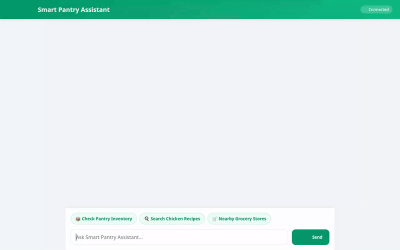

# Smart Pantry Assistant 🥑🛒

Smart Pantry Assistant is an intelligent, personalized AI kitchen helper built with the Google Agent Development Kit (ADK), Gemini, and Google Cloud Platform. It manages your pantry inventory, remembers dietary preferences and allergies across sessions, discovers recipes based on available ingredients, locates nearby supermarkets, and generates food images and videos.



---

## 🌟 Key Features & Google Cloud Integrations

| Feature / Tool | Google Cloud Service / ADK Capability | Description |
| :--- | :--- | :--- |
| **Agent Core & Reasoning** | **Google ADK & Gemini 3.8 Flash** | Core orchestration using `google.adk` Agent with `gemini-3.8-flash` on Vertex AI. |
| **Session Memory Bank** | **Agent Engine Memory Bank** | Persists user dietary restrictions, preferences, and allergies across conversation turns via `PreloadMemoryTool` and `add_session_to_memory`. |
| **Pantry Database** | **Google Cloud Firestore** | Manages real-time inventory in the `pantry_items` Firestore collection in project `qwiklabs-gcp-02-2e386749f61c`. |
| **Media Bucket Storage** | **Google Cloud Storage (GCS)** | Public Cloud Storage bucket `smart-pantry-images-qwiklabs-gcp-02-2e386749f61c` hosting generated images and videos. |
| **AI Food Image Generation** | **Vertex AI Imagen 3 (`imagen-3.0-generate-002`)** | Generates photorealistic food images, stores artifacts, and uploads public URLs to Cloud Storage. |
| **AI Food Video Generation** | **Gemini Omni Flash Preview (`gemini-omni-flash-preview`)** | Generates short video clips using Vertex AI Interactions API, saving artifacts and public Cloud Storage links. |
| **Location & Grocery Finder** | **Google Maps Geocoding & Places API** | Geocodes user addresses and searches for nearby supermarkets and grocery stores (`geocode_address`, `search_nearby_places`). |
| **Recipe Search Engine** | **TheMealDB Public API** | Fetches real recipe ideas and ingredient lists matching pantry stock (`search_recipes`, `search_public_recipes`). |
| **Rich Structured UI Cards** | **A2UI (Agent to UI Schema v0.8)** | Dynamically generates structured UI cards for pantry lists, recipe cards, and location results in the frontend. |
| **Frontend Web Application** | **Google Cloud Run & FastAPI** | Custom dark-themed FastAPI web application deployed to Cloud Run with `roles/aiplatform.user` IAM permissions. |

---

## 🏗️ Architecture & Project Structure

```
smart-pantry-agent/
├── app/
│   ├── agent.py            # Agent definition, system prompt, callbacks, tool bindings
│   ├── tools.py            # Firestore, GCS, Imagen, Omni, Maps, and MealDB tools
│   └── a2ui_utils.py       # A2UI callback utility for response formatting
├── frontend/
│   ├── main.py            # FastAPI web backend communicating with Reasoning Engine
│   ├── Dockerfile         # Python 3.11 container definition for Cloud Run
│   └── static/
│       ├── index.html     # Rebranded dark emerald UI with prompt pills
│       ├── app.js         # Chat UI logic and A2UI renderer
│       └── styles.css     # Glassmorphism design system
├── agents-cli-manifest.yaml # agents-cli project manifest
├── pyproject.toml         # Python dependencies and project settings
├── agent_demo.webm        # Raw screen recording with Lyria background music
└── agent_demo.gif         # Optimized looping demo GIF
```

---

## 🚀 Running Locally

### 1. Install Dependencies & Set Up Virtual Environment

```bash
uv sync
source .venv/bin/activate
```

### 2. Set Up Environment Variables & GCP Auth

```bash
gcloud auth application-default login
export GOOGLE_CLOUD_PROJECT="qwiklabs-gcp-02-2e386749f61c"
```

### 3. Run Agent Engine Local Playground

```bash
uv run adk web . --port 8000 --reload_agents --memory_service_uri=agentengine://7319534668011798528
```

### 4. Run Custom FastAPI Web Frontend

```bash
python frontend/main.py
```
Open [http://localhost:8080](http://localhost:8080) in your browser.

---

## ☁️ Deployment

### 1. Deployed Reasoning Engine Resource
- **Resource Name**: `projects/72504043147/locations/us-east1/reasoningEngines/7319534668011798528`
- **Region**: `us-east1`

### 2. Deployed Frontend on Cloud Run
- **Live URL**: `https://smart-pantry-frontend-72504043147.us-east1.run.app`
- **Deployment Command**:
```bash
gcloud run deploy smart-pantry-frontend \
  --source ./frontend \
  --region us-east1 \
  --allow-unauthenticated \
  --clear-base-image \
  --set-env-vars AGENT_ENGINE_RESOURCE_NAME="projects/72504043147/locations/us-east1/reasoningEngines/7319534668011798528",AGENT_DIRECTORY="app"
```
